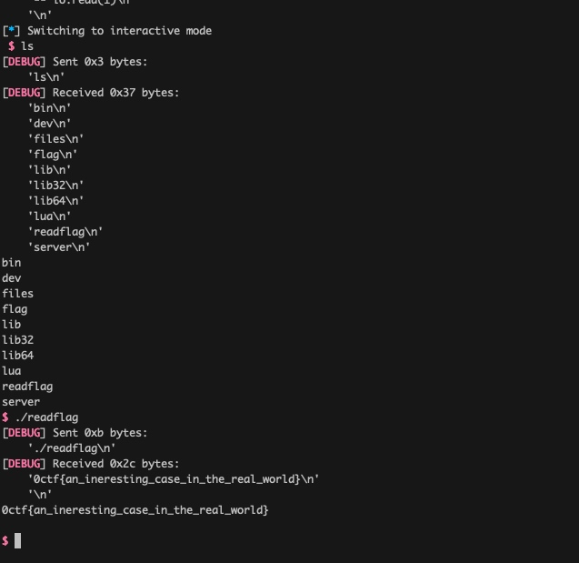

#### WriteUp For 0CTF Babysandbox

This Challenge is inspired by a VPN SSL device I exploited in the work and I use part of the exploit chain as this challenge.
The server is running Lua 5.0.3 with most sensitive functions nopped including `popen`, `execute`.However the function `loadstring` is available.

```diff
-  {"loadfile", luaB_loadfile},
-  {"dofile", luaB_dofile},
+  /* {"loadfile", luaB_loadfile}, */
+  /* {"dofile", luaB_dofile}, */
   {"loadstring", luaB_loadstring},
-  {"require", luaB_require},
+  /* {"require", luaB_require}, */
```

  
BTW, PIE is also compiled to the binary. 

```diff
 # debug information. If you only want the shared libraries, you may want to
 # add -fPIC to MYCFLAGS.
 #
-MYCFLAGS= -O2
+MYCFLAGS= -O2 -fPIC
 #MYCFLAGS= -O3 -fomit-frame-pointer # -fPIC
 
 # Write here any options you may need for your C linker.
-#MYLDFLAGS=
+MYLDFLAGS= -pie -fPIE
```

#### Lua Background

Lua 5.0.3 is a very old version of Lua released in the 2006 and there is a bytecode verifier before lua 5.2 which means lua 5.0.3 also has a verifier. [future of bytecode verifier](http://lua-users.org/lists/lua-l/2009-03/msg00039.html)
There are two types public exploits for the lua bytecode. 

* One is that use the `index-out-of-bound` of `LOADK` in [GitHub - saelo/33c3ctf-repl: Code and exploit for the "read-eval-pwn loop" challenge of 33C3 CTF](https://github.com/saelo/33c3ctf-repl) which is based on lua without bytecode verifier. However, in the verifier of lua 5.0.3, the index of `LOADK` is checked.

```c
switch (getOpMode(op)) {
  case iABC: {
    b = GETARG_B(i);
    c = GETARG_C(i);
    if (testOpMode(op, OpModeBreg)) {
      checkreg(pt, b);
    }
    else if (testOpMode(op, OpModeBrk))
      check(checkRK(pt, b));
    if (testOpMode(op, OpModeCrk))
      check(checkRK(pt, c));
    break;
  }
  case iABx: {
    b = GETARG_Bx(i);
    if (testOpMode(op, OpModeK)) check(b < pt->sizek);
    break;
  }
  case iAsBx: {
    b = GETARG_sBx(i);
    break;
  }
}
```

* The other type exploit pubic is from [Exploiting Lua 5.1 on 32-bit Windows.md · GitHub](https://gist.github.com/corsix/6575486)
which exploited by the type confusion of `FORLOOP`. But this vulnerable is unavailable in 5.0.3 which checks the type of `FORLOOP` params.

```c
case OP_FORLOOP: {
  lua_Number step, idx, limit;
  const TObject *plimit = ra+1;
  const TObject *pstep = ra+2;
  if (!ttisnumber(ra))
    luaG_runerror(L, "`for' initial value must be a number");
  if (!tonumber(plimit, ra+1))
    luaG_runerror(L, "`for' limit must be a number");
  if (!tonumber(pstep, ra+2))
    luaG_runerror(L, "`for' step must be a number");
  step = nvalue(pstep);
  idx = nvalue(ra) + step;  /* increment index */
  limit = nvalue(plimit);
  if (step > 0 ? idx <= limit : idx >= limit) {
    dojump(pc, GETARG_sBx(i));  /* jump back */
    chgnvalue(ra, idx);  /* update index */
  }
  break;
}
```

So No public exploitations are available here.

#### Hunt For a new one.

The vulnerablity I found lays in opcode `FORPREP` which can control PC in lua vm and no check in verifier

```c
case OP_TFORPREP: {  /* for compatibility only */
  if (ttistable(ra)) {
    setobjs2s(ra+1, ra);
    setobj2s(ra, luaH_getstr(hvalue(gt(L)), luaS_new(L, "next")));
  }
  dojump(pc, GETARG_sBx(i));
  break;
}
```


```c
  opmode(0, 1, 0, 0, 1, 0, iABC)		/* OP_MOVE */
 ,opmode(0, 0, 0, 0, 1, 1, iABx)		/* OP_LOADK */
 ,opmode(0, 0, 0, 0, 1, 0, iABC)		/* OP_LOADBOOL */
 ,opmode(0, 1, 0, 0, 1, 0, iABC)		/* OP_LOADNIL */
 
case iAsBx: {
 b = GETARG_sBx(i);
 break;
}
```

#### Info Leak

Lua is able to leak an address of `table` or `function` which lays in heap.

```
Lua 5.0.3  Copyright (C) 1994-2006 Tecgraf, PUC-Rio
> print(tostring({}))
table: 0x55afbd47d7b0
```

#### Aribitrary Address Read


Here use struct table to Heap Fengshui and the size of Table is 0x48

```c
typedef struct Table {
  CommonHeader;
  lu_byte flags;  /* 1<<p means tagmethod(p) is not present */ 
  lu_byte lsizenode;  /* log2 of size of `node' array */
  struct Table *metatable;
  TObject *array;  /* array part */
  Node *node;
  Node *firstfree;  /* this position is free; all positions after it are full */
  GCObject *gclist;
  int sizearray;  /* size of `array' array */
} Table;
```
So we can leak the string address:

```lua
a = {}
print(tostring(a))
a = nil
collectgarbage()
a = string.rep("a", 47)
```
Furthermore, any kind of structure whose size is 0x50 in Lua can be leak in this method including the constant chunk and PC chunk of function.
We construct such a function:

```lua
-- assert constant foo = 4
-- assert instruct foo = 8 or 9
local function foo()
   local a=1
   local b=2
   b = nil
   return string.len(a)
end
```

```
function <x.lua:1> (9 instructions, 72 bytes at 0x18b6a90)
0 params, 4 stacks, 0 upvalues, 2 locals, 4 constants, 0 functions
	1	[2]	LOADK    	0 0	; 1
	2	[3]	LOADK    	1 1	; 2
	3	[4]	LOADNIL  	1 1 0
	4	[5]	GETGLOBAL	2 2	; string
	5	[5]	GETTABLE 	2 2 253	; "len"
	6	[5]	MOVE     	3 0 0
	7	[5]	TAILCALL 	2 2 0
	8	[5]	RETURN   	2 0 0
	9	[6]	RETURN   	0 1 0
```

After that, We can replace the `LOADK 0 0` to `FORREPR 0 PC` to JUMP to the fake PC chunk we controlled.

In the fake PC chunk, we `LOADK 0 ADDR` and jump back to the `foo` function. The address is a string type in LUA.

```c
LUA_API size_t lua_strlen (lua_State *L, int idx) {
  StkId o = luaA_indexAcceptable(L, idx);
  if (o == NULL)
    return 0;
  else if (ttisstring(o))
    return tsvalue(o)->tsv.len;
  else {
    size_t l;
    lua_lock(L);  /* `luaV_tostring' may create a new string */
    l = (luaV_tostring(L, o) ? tsvalue(o)->tsv.len : 0);
    lua_unlock(L);
    return l;
  }
}
```

```c
/*
** Lua values (or `tagged objects')
*/
typedef struct lua_TObject {
  int tt;
  Value value;
} TObject;
```


#### Arbitrary Address Write

`Write` is very similar to `READ`. Here we jump to the opcode `settable` to write.

#### Shell

With Arbitrary Address Read and Write, we are able to leak libc base, leak stack as well as leak ELF base.

Here I exploit by changing the return address in stack to the one garget in libc as well as set ```*($rsp+0x50)=0```

#### Conclusion

The whole exploit has been attached and the success rate is about ten percentages, which is enough in CTF. But in the real world, this rate should be improved and I am looking forward to sharing how it can be improved as well as the whole exploit chain of the VPN SSL device in the future. 




